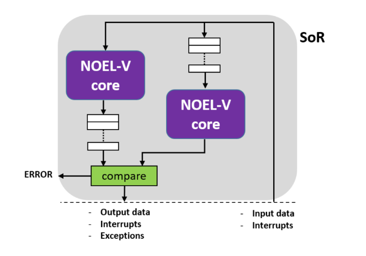

# SafeLS

The Safe Lockstep (SafeLS for short) unit is a RISC-V open-source lockstep core based on Frontgrade Gaisler AB's NOEL-V core for the space domain, as well as its integration in the SELENE SoC ([https://gitlab.com/selene-riscv-platform/selene-hardware](https://gitlab.com/selene-riscv-platform/selene-hardware)) that provides a complete microcontroller synthesizable on FPGA successfully assessed against space, automotive and railway safety-critical applications in the past.

## Description

The sphere of replication is at a core level, so the NOEL-V core and its signals are replicated. Input signals are routed directly to the master core. In contrast, in the shadow core (the replicated core), input signals will pass first to staggering registers to desynchronize the pair of cores. This ensures that both of them are in different phases of execution (x instructions). 
Outputs of the master core are sent to a second set of staggering registers. The delayed results are then compared with the ones from the shadow core and forwarded if no mismatch is detected. The signal "error" is activated otherwise.
The architecture described can be seen in the picture below:

## Reference
If you are using the SafeLS for an academic publication, please cite the following paper:
(Waiting publish paper to appear)

# Future work

* The management of the error signal is currently not exported to software. We are now in the process of making it a core interrupt, propagating it to the CLINT, and capturing it at the software level whenever raised.

* The strong timing constraints imposed by the AHB protocol implementation which does not allow for delaying AHB outputs of the cores. Hence, we cannot stagger those outputs and compare them prior to delivering them to the AHB interface since doing so leads to a platform crash due the timing constraints. Instead, signals from the main core are delivered immediately to preserve original timings, and staggering is used for comparison and error detection. However, upon a mismatch detection, the potentially erroneous output of the master core has already been delivered for a few cycles (i.e., as many as the number of cycles used for staggering). This requires either means to stop the propagation of such signal or, instead, modifying the AHB interface module of the core so that some staggering is allowed and those signals can be delivered to the AHB interface only after successful comparison. We are currently investigating the latter's viability since it would preserve the canonical implementation of DCLS.

