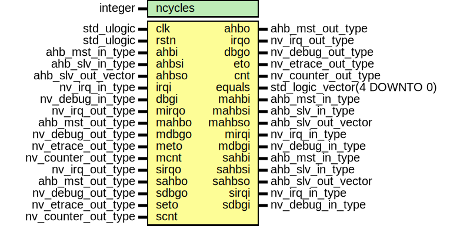

# Entity: l_comparator 

- **File**: l_comparator.vhd
## Diagram

## Generics

| Generic name | Type    | Value | Description                                              |
| ------------ | ------- | ----- | -------------------------------------------------------- |
| ncycles      | integer | 2     | Number of cycles between the two executions (staggering) |
## Ports

| Port name | Direction | Type                         | Description                                |
| --------- | --------- | ---------------------------- | ------------------------------------------ |
| clk       | in        | std_ulogic                   | Generic Clock signal                       |
| rstn      | in        | std_ulogic                   | Generic Reset signal                       |
| ahbi      | in        | ahb_mst_in_type              | Front Signals CMP - NoelVCPU (ahb  input)  |
| ahbo      | out       | ahb_mst_out_type             | Front Signals CMP - NoelVCPU (ahb  output) |
| ahbsi     | in        | ahb_slv_in_type              |                                            |
| ahbso     | in        | ahb_slv_out_vector           |                                            |
| irqi      | in        | nv_irq_in_type               |                                            |
| irqo      | out       | nv_irq_out_type              |                                            |
| dbgi      | in        | nv_debug_in_type             |                                            |
| dbgo      | out       | nv_debug_out_type            |                                            |
| eto       | out       | nv_etrace_out_type           |                                            |
| cnt       | out       | nv_counter_out_type          |                                            |
| equals    | out       | std_logic_vector(4 DOWNTO 0) |                                            |
| mahbi     | out       | ahb_mst_in_type              | Master Signals                             |
| mahbsi    | out       | ahb_slv_in_type              |                                            |
| mahbso    | out       | ahb_slv_out_vector           |                                            |
| mirqi     | out       | nv_irq_in_type               |                                            |
| mdbgi     | out       | nv_debug_in_type             |                                            |
| mirqo     | in        | nv_irq_out_type              |                                            |
| mahbo     | in        | ahb_mst_out_type             |                                            |
| mdbgo     | in        | nv_debug_out_type            |                                            |
| meto      | in        | nv_etrace_out_type           |                                            |
| mcnt      | in        | nv_counter_out_type          |                                            |
| sahbi     | out       | ahb_mst_in_type              | Slave Signals                              |
| sahbsi    | out       | ahb_slv_in_type              |                                            |
| sahbso    | out       | ahb_slv_out_vector           |                                            |
| sirqi     | out       | nv_irq_in_type               |                                            |
| sdbgi     | out       | nv_debug_in_type             |                                            |
| sirqo     | in        | nv_irq_out_type              |                                            |
| sahbo     | in        | ahb_mst_out_type             |                                            |
| sdbgo     | in        | nv_debug_out_type            |                                            |
| seto      | in        | nv_etrace_out_type           |                                            |
| scnt      | in        | nv_counter_out_type          |                                            |
## Signals

| Name       | Type                | Description |
| ---------- | ------------------- | ----------- |
| reg_ahbo   | ahb_mst_out_type    |             |
| reg_irqo   | nv_irq_out_type     |             |
| reg_dbgo   | nv_debug_out_type   |             |
| reg_eto    | nv_etrace_out_type  |             |
| reg_cnt    | nv_counter_out_type |             |
| reg_equal  | std_logic           |             |
| reg_hsirqo | nv_irq_out_type     |             |
| reg_hsahbo | ahb_mst_out_type    |             |
| reg_hsdbgo | nv_debug_out_type   |             |
| reg_hseto  | nv_etrace_out_type  |             |
| reg_hscnt  | nv_counter_out_type |             |
| v_ahbi     | t_ahbi              |             |
| v_ahbsi    | t_ahbsi             |             |
| v_ahbso    | t_ahbso             |             |
| v_irqi     | t_irqi              |             |
| v_dbgi     | t_dbgi              |             |
| v_irqo     | t_sirqo             |             |
| v_ahbo     | t_sahbo             |             |
| v_dbgo     | t_sdbgo             |             |
| v_eto      | t_seto              |             |
| v_cnt      | t_scnt              |             |
| rreg_ahbi  | ahb_mst_in_type     |             |
| rreg_ahbsi | ahb_slv_in_type     |             |
| rreg_ahbso | ahb_slv_out_vector  |             |
| rreg_irqi  | nv_irq_in_type      |             |
| rreg_dbgi  | nv_debug_in_type    |             |
| rreg_ahbo  | ahb_mst_out_type    |             |
| rreg_irqo  | nv_irq_out_type     |             |
| rreg_dbgo  | nv_debug_out_type   |             |
| rreg_eto   | nv_etrace_out_type  |             |
| rreg_cnt   | nv_counter_out_type |             |
## Types

| Name    | Type | Description |
| ------- | ---- | ----------- |
| t_ahbi  |      |             |
| t_ahbsi |      |             |
| t_ahbso |      |             |
| t_irqi  |      |             |
| t_dbgi  |      |             |
| t_sirqo |      |             |
| t_sahbo |      |             |
| t_sdbgo |      |             |
| t_seto  |      |             |
| t_scnt  |      |             |
## Processes
- outputs_reg: ( rreg_ahbo, rreg_dbgo )
  - **Description**
  TBD 
- out_hold_slv: ( sahbo, sdbgo )
  - **Description**
  TBD 
- ahbo0: ( clk, reg_ahbo, reg_dbgo )
  - **Description**
  Process which performs the comparison of the outputs to AHB 
